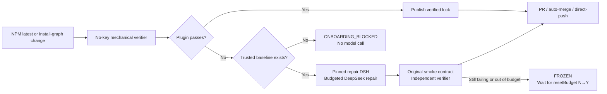

<div align="center">
  
  <h1>DSH Plugin Compatibility Guardian</h1>
  <p><strong>Let DeepSeek Harness plugins keep themselves compatible with DSH updates.</strong></p>
  <p>Detect a new release → install and boot it in isolation → repair with DSH when needed → independently verify → deliver a merge-ready PR.</p>

  [中文](README.md) · [Whitepaper](docs/WHITEPAPER.md) · [Real validation](docs/FINAL_VALIDATION.md)

  
  
  
</div>

The official [DeepSeek Harness](https://github.com/deepseek-ai/deepseek-harness) repository currently labels DSH a developer preview and warns about breaking changes. Guardian focuses on one job: prove that a plugin still installs, boots and behaves on the latest DSH; if a verified regression exists, repair it safely.

## Install in 60 seconds

Run this from a clean plugin repository with Node 24 and an authenticated `gh` CLI:

```bash
npm exec --yes \
  --package=github:LCYLYM/dsh-plugin-compat-guardian#317e9858dedf2c16c24558b9d448ac7b24190b41 \
  -- dsh-plugin-compat-guardian onboard \
  --guardian-ref LCYLYM/dsh-plugin-compat-guardian/.github/workflows/guardian.yml@317e9858dedf2c16c24558b9d448ac7b24190b41
```

The command opens one onboarding PR; it does not modify the default branch directly. Review the generated config, plugin-specific smoke contract, and immutable 40-character Guardian SHA. Then configure the repository:

```bash
gh secret set DEEPSEEK_API_KEY

gh api --method PUT repos/{owner}/{repo}/actions/permissions/workflow \
  -f default_workflow_permissions=read \
  -F can_approve_pull_request_reviews=true
```

The second command lets Actions create maintenance PRs while keeping default workflow permissions read-only. Without it, Guardian can still push the verified branch and stops at `WAITING_FOR_GITHUB_APPROVAL` for a human to open the PR.

## How it works



The verifier freezes the exact DSH version, NPM integrity and full dependency graph; installs the repository with its native npm/pnpm/yarn rules; builds and tests it; packs the real plugin; installs it into an isolated `DSH_HOME`; checks `dump-config`; boots a real `dsh web`; executes the reviewed plugin smoke assertion; removes the plugin and checks for residue.

Model repair is eligible only when the same gates prove that an existing baseline passed and the new candidate failed. A first-run repository failure is reported as `ONBOARDING_BLOCKED`, not mislabeled as a DSH regression.

## Delivery and safety

| Mode | Behavior | Default |
| --- | --- | --- |
| `pull-request` | Open a reviewable PR | Yes |
| `auto-merge` | Open a PR and merge after required checks/rules | Off |
| `direct-push` | Push a verified change to the default branch | Off |

Changes to tests, test commands, install lifecycle scripts, dependency majors, or dependency additions/removals always force a normal human-review PR. Control files, workflows, the lock, the reviewed smoke contract, credentials and paths outside the repository are protected from the repair agent.

Each `repository + target DSH version` campaign defaults to 1,000,000 tokens, an estimated 10 CNY, 60 active minutes and two model attempts. At 30% remaining budget, Guardian can send one convergence message. One target version receives one automatic repair campaign; after exhaustion, increase the limits or commit `resetBudget: Y` in `.dsh-compat.lock.json`. That `Y` edge is consumed back to `N` once.

Deterministic checks run immediately. Only code repair may wait for the configured DeepSeek low-price window. CNY is a local estimate from DSH-reported usage and the configured price snapshot, not an account-level billing circuit breaker.

## Configurable defaults

- Candidate DSH follows NPM `latest`, including dependency-graph changes under an unchanged root version.
- Repair DSH is pinned to `0.1.1-rc.2` by default.
- The default route is `deepseek-official/deepseek-v4-flash-vision-exp`; provider, base URL, Secret environment name and model ID are configurable.
- Repair DSH may use official DeepSeek search when useful; search is optional and has no separate Guardian limit.
- Monorepos select a package with `plugin.workspace`; repository installation and gates remain at the root.
- GitHub Summary/Issue are built in; email, Telegram and webhook are optional narrow adapters.

See [`.dsh-compat.example.yml`](.dsh-compat.example.yml) for the complete configuration.

## Real evidence

| Fixture | Result | Boundary proved |
| --- | --- | --- |
| [`dsh-attachments-guardian-fixture`](https://github.com/LCYLYM/dsh-attachments-guardian-fixture) | Real auto-repair | Controlled incompatibility → DSH repair → independent verification → PR, plus visual smoke, direct push, auto-merge safety and NOOP evidence |
| [`dsh-whale-report` fork](https://github.com/LCYLYM/dsh-whale-report/actions/runs/32570423087) / [PR #1](https://github.com/LCYLYM/dsh-whale-report/pull/1) | PASS | Real plugin API assertion and install/boot/remove round trip |
| [`dsh-web-ui` fork](https://github.com/LCYLYM/dsh-web-ui/actions/runs/32570426593) / [PR #1](https://github.com/LCYLYM/dsh-web-ui/pull/1) | PASS | A package selected from a large pnpm monorepo |
| [`dsh-ankh-guard` fork](https://github.com/LCYLYM/dsh-ankh-guard/actions/runs/32570430758) / [PR #1](https://github.com/LCYLYM/dsh-ankh-guard/pull/1) | PASS | Install/composition/web boot; this does not claim watchdog behavior coverage |
| [`better-sidebar-office` fork](https://github.com/LCYLYM/dsh-plugin-better-sidebar-plugin-office/actions/runs/32570428991) | ONBOARDING_BLOCKED | A withdrawn historical package blocks a trustworthy baseline, so no model repair is attempted |

Reports are Chinese-first and human-scannable. They persist sanitized command evidence, hashes, status, duration and usage—never API keys, authorization headers, full model conversations or private local paths.

The three community PRs were opened manually through Guardian's documented `WAITING_FOR_GITHUB_APPROVAL` fallback because their first runs finished before the repository setting allowed Actions-created PRs. They are not presented as bot-created PRs; fixture PRs #10/#19 provide that evidence.

## Scope and risk

- Guardian is not a general dependency-upgrade, CI-rewrite or refactoring bot.
- A compatibility claim is only as strong as the reviewed plugin-specific smoke contract. A web-shell-only assertion proves boot, not full client behavior.
- `direct-push` bypasses human review. Use branch protection, CODEOWNERS and strong repository gates before enabling it.
- Secrets are available only to trusted default-branch repair jobs and explicitly reviewed no-write model-smoke jobs. Ordinary and fork PR code does not receive the key.
- This project is independent and is not affiliated with DeepSeek. Review the workflow, pinned SHA and permissions before use.

## Documentation

- [Design and state machine](docs/DESIGN.md)
- [Whitepaper](docs/WHITEPAPER.md)
- [Requirement-to-implementation matrix](docs/IMPLEMENTATION_PLAN.md)
- [Scope/deviation audit](docs/SCOPE_AUDIT.md)
- [Final validation](docs/FINAL_VALIDATION.md)
- [Historical evidence](docs/REFERENCE_EVIDENCE.md)
- [Acceptance contract](ACCEPTANCE.md) · [Current state](STATE.md)

## Development

```bash
npm ci
npm run check
```

Current local suite: 46/46 passing. MIT licensed.
