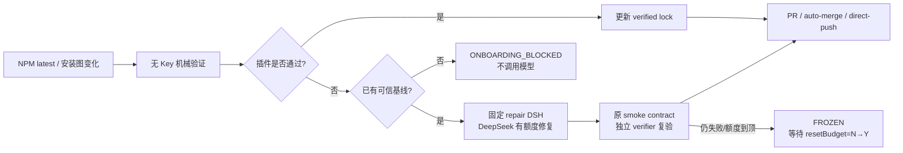

<div align="center">
  
  <h1>DSH Plugin Compatibility Guardian</h1>
  <p><strong>让 DeepSeek Harness 插件自己跟上 DSH 更新。</strong></p>
  <p>自动发现新版 → 隔离安装与真实启动 → 不兼容时用 DSH 本身修复 → 独立复验 → 交付可合并 PR。</p>

  [English](README.en.md) · [设计白皮书](docs/WHITEPAPER.md) · [真实验收](docs/FINAL_VALIDATION.md)

  
  
  
</div>

> [DeepSeek Harness](https://github.com/deepseek-ai/deepseek-harness) 官方将当前阶段标为 developer preview，并明确提醒可能有破坏性变更。Guardian 只解决这一个问题：**DSH 更新后，插件还能否安装、启动和工作？不能时能否自动修好？**

## 60 秒安装

要求：目标插件仓库已有可运行的测试/构建命令，本机已登录 `gh`，工作树干净。

```bash
npm exec --yes \
  --package=github:LCYLYM/dsh-plugin-compat-guardian#317e9858dedf2c16c24558b9d448ac7b24190b41 \
  -- dsh-plugin-compat-guardian onboard \
  --guardian-ref LCYLYM/dsh-plugin-compat-guardian/.github/workflows/guardian.yml@317e9858dedf2c16c24558b9d448ac7b24190b41
```

这条命令会打开一个 onboarding PR，不会直接改默认分支。你只需首次审核三件事：

1. `.dsh-compat.yml` 里的测试命令、额度和交付模式。
2. `compatibility/dsh-smoke.yml` 是否真的证明了你的插件能力。
3. workflow 是否固定到完整 40 位 Guardian commit SHA。

然后在仓库设置中完成两项：

```bash
# 安全地提示输入，不把 key 写进文件或 shell 历史
gh secret set DEEPSEEK_API_KEY

# 允许 GitHub Actions 创建维修 PR；默认权限仍保持 read
gh api --method PUT repos/{owner}/{repo}/actions/permissions/workflow \
  -f default_workflow_permissions=read \
  -F can_approve_pull_request_reviews=true
```

> 不想让 Actions 建 PR 也可以。Guardian 会推送已验证分支并停在 `WAITING_FOR_GITHUB_APPROVAL`，你手工开 PR 即可。

## 它实际做什么



无模型 verifier 会在临时目录中：

- 冻结当次 `@deepseek-ai/dsh` 精确版本、NPM integrity 和完整安装图。
- 按仓库原生 npm/pnpm/yarn 规则安装依赖并跑测试/构建。
- 用 `npm pack` 产出真实插件 tarball，安装到隔离 `DSH_HOME`。
- 检查 `dump-config`，真实启动 `dsh web`，执行插件专属 smoke，再卸载并确认无残留。
- 仅当“旧基线 PASS、新候选 FAIL”时才允许模型维修。

## 一眼能看懂的报告

Actions Summary、Issue 和 PR 默认使用中文，先给结论和下一步，再折叠展开机械证据：

```text
🛡️ DSH 插件兼容性报告
✅ 已通过

目标 DSH       @deepseek-ai/dsh@0.1.1-rc.2
插件           dsh-whale-report@0.1.4
检查           22 项通过 / 0 项失败
下一步       审核并合并 verified lock PR
```

报告只保存脱敏后的命令摘要、hash、状态、耗时和 usage。API Key、认证头、完整模型对话和本机私有路径不进报告。

## 交付模式

| 模式 | 会发生什么 | 默认 |
| --- | --- | --- |
| `pull-request` | 生成可审核 PR | ✅ |
| `auto-merge` | 先建 PR，checks/分支规则通过后合并 | 关 |
| `direct-push` | 通过复验后直接推默认分支 | 关 |

`auto-merge` 和 `direct-push` 是真能力，但不默认开启。如果修复改了测试、测试命令、安装脚本、依赖 major 或新增/删除依赖，无论仓库选什么都强制回到人工 PR。

## 额度、低价时段与防死循环

默认的每个“仓库 + 目标 DSH 版本”维修活动：

- 最多 1,000,000 token、10 CNY 估算、60 分钟活跃时间、2 轮模型尝试。
- 预算只剩 30% 时，默认给 repair DSH 发一次“尽快收敛”提醒，可关闭。
- 确定性测试立即跑；只有确实要调模型修代码时，才可选等待 DeepSeek 低价时段。
- 同一版本默认只自动维修一次。额度到顶后，只有提高限额，或把 `.dsh-compat.lock.json` 中 `resetBudget` 从 `N` 改成 `Y` 并提交，才再维修一次；该次 `Y` 会立即消费回 `N`。
- timeout/429/5xx 不循环烧钱：只短重试一次，然后等手工运行、相关配置变化或新 DSH 版本。

CNY 是按 DSH 暴露的 usage 和仓库中的价格快照估算，不是 DeepSeek 账户账单级硬限额。绝对账户限额仍应在 provider 侧设置。

## 默认与可配置项

- 候选 DSH：跟踪 NPM `latest`，即使根版本号未变但内部安装图变了也会复测。
- repair DSH：默认固定 `0.1.1-rc.2`，可改；每次 campaign 开始后锁定。
- provider/model：默认 `deepseek-official/deepseek-v4-flash-vision-exp`，可改 `base_url`、Secret 环境变量名和 model ID。
- DeepSeek 官方搜索：repair DSH 可按需使用，不要求每轮搜，不另设搜索次数上限。
- monorepo：用 `plugin.workspace` 指向真实插件 package；仓库依赖安装和 gates 仍在 root 运行。
- 通知：GitHub Summary/Issue 内置；email、Telegram 和 webhook 是可选窄网关。

完整示例见 [`.dsh-compat.example.yml`](.dsh-compat.example.yml)。

## 真实证据

| 样本 | 结果 | 当前证明的边界 |
| --- | --- | --- |
| [`dsh-attachments-guardian-fixture`](https://github.com/LCYLYM/dsh-attachments-guardian-fixture) | ✅ 真实自动修复 | 受控不兼容 → DSH 维修 → 独立复验 → PR，另有视觉 smoke/direct-push/auto-merge/NOOP 证据 |
| [`dsh-whale-report` fork](https://github.com/LCYLYM/dsh-whale-report/actions/runs/32570423087) / [PR #1](https://github.com/LCYLYM/dsh-whale-report/pull/1) | ✅ PASS | 真实插件 API 断言、安装/启动/卸载 |
| [`dsh-web-ui` fork](https://github.com/LCYLYM/dsh-web-ui/actions/runs/32570426593) / [PR #1](https://github.com/LCYLYM/dsh-web-ui/pull/1) | ✅ PASS | 大型 pnpm monorepo 中的 Skill Explorer package |
| [`dsh-ankh-guard` fork](https://github.com/LCYLYM/dsh-ankh-guard/actions/runs/32570430758) / [PR #1](https://github.com/LCYLYM/dsh-ankh-guard/pull/1) | ✅ PASS | 新于当前宿主的 peer cohort 仍能安装、组合、启动；不等于 watchdog 行为验收 |
| [`better-sidebar-office` fork](https://github.com/LCYLYM/dsh-plugin-better-sidebar-plugin-office/actions/runs/32570428991) | 🛑 ONBOARDING_BLOCKED | 历史 lock 依赖已从 NPM 撤下；没有可信基线，正确不调模型 |

完整运行 ID、PR、实际 token/估算 CNY 和尚未绑定的可选外部渠道，见 [最终验收报告](docs/FINAL_VALIDATION.md)。

> 三个社区 PR 是按第一次 run 给出的 `WAITING_FOR_GITHUB_APPROVAL` 回退路径手工打开；不写成 Actions 自动建 PR。机器人自动建 PR 的真实证据是 fixture PR #10/#19。

## 边界和风险

- Guardian 是维修机器人，不是通用依赖升级、测试改写或代码整理机器人。
- 插件专属 smoke 的证明力决定兼容结论的上限。客户端插件如果只断言了 web shell，就只能证明安装/启动，不能宣称 UI 行为已验收。
- `direct-push` 能绕过人工 review；开启前应配合分支保护、CODEOWNERS 和仓库自带测试。
- Secret 只进入可信默认分支上的 repair job，以及 contract 明确启用的无 Git 写权模型 smoke job。fork PR 和普通 PR 代码不会拿到 Key。
- 本项目与 DeepSeek 官方无隶属关系。使用前请审核 workflow、固定 SHA 和仓库权限。

## 文档导航

- [方案与状态机](docs/DESIGN.md)
- [白皮书](docs/WHITEPAPER.md)
- [完整需求与落地对照](docs/IMPLEMENTATION_PLAN.md)
- [原设计偏离/缺失/多做审计](docs/SCOPE_AUDIT.md)
- [最终验收报告](docs/FINAL_VALIDATION.md)
- [历史证据](docs/REFERENCE_EVIDENCE.md)
- [长期验收合同](ACCEPTANCE.md) · [当前状态](STATE.md)

## 开发

```bash
npm ci
npm run check
```

当前本地套件：46/46 通过。项目采用 MIT License。
