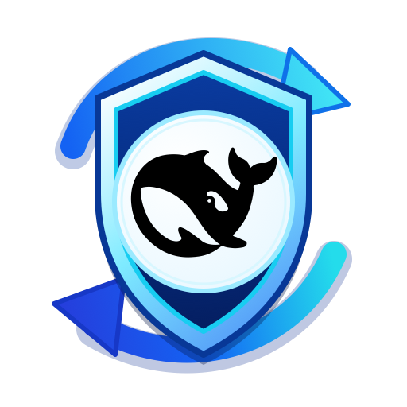
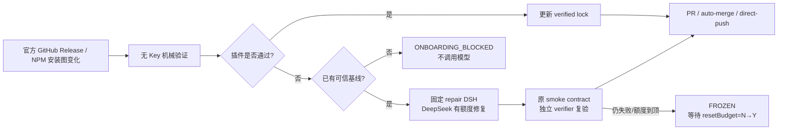

<div align="center">
  
  <h1>DSH Plugin Compatibility Guardian</h1>
  <p><strong>让 DeepSeek Harness 插件自己跟上 DSH 更新。</strong></p>
  <p>自动发现新版 → 隔离安装与真实启动 → 不兼容时用 DSH 本身修复 → 独立复验 → 交付可合并 PR。</p>

  [English](README.en.md) · [设计白皮书](docs/WHITEPAPER.md) · [真实验收](docs/FINAL_VALIDATION.md)

  
  
  
</div>

> [DeepSeek Harness](https://github.com/deepseek-ai/deepseek-harness) 官方将当前阶段标为 developer preview，并明确提醒可能有破坏性变更。Guardian 只解决这一个问题：**DSH 更新后，插件还能否安装、启动和工作？不能时能否自动修好？**

## 正式安装：放进你的插件仓库

要求：目标插件仓库已有可运行的测试/构建命令，本机已登录 `gh`，工作树干净。

```bash
npm exec --yes \
  --package=github:LCYLYM/dsh-plugin-compat-guardian#3de35600566ad1f4ff318e2de3d99de48b6ec72a \
  -- dsh-plugin-compat-guardian onboard \
  --guardian-ref LCYLYM/dsh-plugin-compat-guardian/.github/workflows/guardian.yml@3de35600566ad1f4ff318e2de3d99de48b6ec72a
```

这条命令会打开一个 onboarding PR，不会直接改默认分支。你只需首次审核三件事：

1. `.dsh-compat.yml` 里的测试命令、额度和交付模式。
2. `compatibility/dsh-smoke.yml` 是否真的证明了你的插件能力。
3. workflow 是否固定到完整 40 位 Guardian commit SHA。

然后在仓库设置中完成两项：

```bash
# 安全地提示输入，不把 key 写进文件或 shell 历史
gh secret set DEEPSEEK_API_KEY

# 允许 GitHub Actions 创建维修 PR；默认权限仍保持 read
gh api --method PUT repos/{owner}/{repo}/actions/permissions/workflow \
  -f default_workflow_permissions=read \
  -F can_approve_pull_request_reviews=true
```

> 不想让 Actions 建 PR 也可以。Guardian 会推送已验证分支并停在 `WAITING_FOR_GITHUB_APPROVAL`，你手工开 PR 即可。

### 原仓库和 fork 测试仓库有什么不同？

| | 插件原仓库 | 只用来试 Guardian 的 fork |
| --- | --- | --- |
| 目标 | 长期自动跟进 DSH `latest` | 证明一次真实 AI 维修闭环 |
| 触发 | 保留每 6 小时和手动检查 | 只保留 `workflow_dispatch` |
| Secret | 在原仓库设置 | fork 不会继承 Secret，必须在 fork 里单独设置 |
| 交付 | 默认产出可审核 PR | 测完合并测试 PR，然后关闭 fork 的 Actions 总开关并删 Secret |

如果插件对新 DSH 本来就兼容，Guardian 只跑确定性验证，**不调 AI**；这是正常的生产行为，不能拿来证明“AI 修过了”。要做真实维修演练，先建立旧 DSH 的 PASS 基线，再让新 DSH 触发可解释的兼容边界，最后必须看到非零模型 usage、代码 diff、独立 verifier 耗时和可合并 PR。

完整操作和本项目的四个公开 fork 案例见 [fork 真实 AI 维修测试教程](docs/FORK_TESTING.md)。

## 它实际做什么



无模型 verifier 会在临时目录中：

- 冻结当次 `@deepseek-ai/dsh` 精确版本、NPM integrity 和完整安装图。
- 按仓库原生 npm/pnpm/yarn 规则安装依赖并跑测试/构建。
- 用 `npm pack` 产出真实插件 tarball，安装到隔离 `DSH_HOME`。
- 检查 `dump-config`，真实启动 `dsh web`，执行插件专属 smoke，再卸载并确认无残留。
- 仅当“旧基线 PASS、新候选 FAIL”时才允许模型维修。

## 一眼能看懂的报告

Actions Summary、Issue 和 PR 默认使用中文，先给结论和下一步，再折叠展开机械证据：

```text
🛡️ DSH 插件兼容性报告
✅ 已通过

目标 DSH       @deepseek-ai/dsh@0.1.1-rc.2
插件           dsh-whale-report@0.1.4
检查           22 项通过 / 0 项失败
下一步       审核并合并 verified lock PR
```

报告只保存脱敏后的命令摘要、hash、状态、耗时和 usage。API Key、认证头、完整模型对话和本机私有路径不进报告。

## 交付模式

| 模式 | 会发生什么 | 默认 |
| --- | --- | --- |
| `pull-request` | 生成可审核 PR | ✅ |
| `auto-merge` | 先建 PR，checks/分支规则通过后合并 | 关 |
| `direct-push` | 通过复验后直接推默认分支 | 关 |

`auto-merge` 和 `direct-push` 是真能力，但不默认开启。如果修复改了测试、测试命令、安装脚本、依赖 major 或新增/删除依赖，无论仓库选什么都强制回到人工 PR。

## 额度、低价时段与防死循环

默认的每个“仓库 + 目标 DSH 版本”维修活动：

- 最多 1,000,000 token、10 CNY 估算、60 分钟活跃时间、2 轮模型尝试。
- 预算只剩 30% 时，默认给 repair DSH 发一次“尽快收敛”提醒，可关闭。
- 确定性测试立即跑；只有确实要调模型修代码时，才可选等待 DeepSeek 低价时段。
- 同一版本默认只自动维修一次。额度到顶后，只有提高限额，或把 `.dsh-compat.lock.json` 中 `resetBudget` 从 `N` 改成 `Y` 并提交，才再维修一次；该次 `Y` 会立即消费回 `N`。
- 缺 Key、401/403、错误 model/base URL/provider 会产生可读的 `BLOCKED_CONFIG` 状态 PR；修正前 schedule 不会每 6 小时再调模型。
- timeout/429/5xx 不循环烧钱：DSH provider 在同一模型回合内最多重试一次，仍失败则持久化为 `BLOCKED_EXTERNAL`。
- 同目标的状态分支或维修 PR 尚未合并时，后续 schedule 在调模型前就停下，不会重复维修。

CNY 是按 DSH 暴露的 usage 和仓库中的价格快照估算，不是 DeepSeek 账户账单级硬限额。绝对账户限额仍应在 provider 侧设置。

`attempts_used` 记的是 Guardian 维修轮次，不是底层 HTTP 请求数。一个 DSH 回合可能包含流式续请求、工具回合或 provider 内部的一次短重试。

## 默认与可配置项

- 候选 DSH：默认跟踪官方 `deepseek-ai/deepseek-harness` 的 `dsh-v*` GitHub Release，包含 prerelease；随后要求同版本 NPM 包存在并用它做真实安装。GitHub Release 已发布但 NPM 尚未发布时进入 `WAITING_FOR_NPM_ARTIFACT`，不调用模型、不建 PR。
- 兼容候选按 Release tag + commit SHA + NPM integrity 锁定；同版本重新打 tag 也会被识别为新快照。需要兼容旧行为时可将 `watch.source` 改为 `npm`。
- repair DSH：默认固定 `0.1.1-rc.2`，可改；每次 campaign 开始后锁定。
- provider/model：默认 `deepseek-official/deepseek-v4-flash-vision-exp`。已实测支持自定义 DeepSeek `base_url`、Key 值、Key 环境变量引用和 model ID；Guardian 会直接 patch DSH 原生 `llm-deepseek` adapter。
- GitHub Secret：默认只需建立 `DEEPSEEK_API_KEY`。`.dsh-compat.yml` 的 `api_key_env` 是 DSH 进程内的凭据引用，不是 GitHub Secret 的名字；仓库用别的 Secret 名时，只改薄 workflow 中 `deepseek_api_key` 的 Secret 映射。
- 其他 provider：只填一个 provider 字符串不会自动安装 adapter。V1 只对 `deepseek-official` 路由做自动配置；其他 provider 必须已在所选 DSH profile 中注册，否则会停在 `MODEL_PROVIDER_NOT_REGISTERED`。
- DeepSeek 官方搜索：repair DSH 可按需使用，不要求每轮搜，不另设搜索次数上限。
- monorepo：用 `plugin.workspace` 指向真实插件 package；仓库依赖安装和 gates 仍在 root 运行。
- 通知：GitHub Summary/Issue 内置；email、Telegram 和 webhook 是可选窄网关。

完整示例见 [`.dsh-compat.example.yml`](.dsh-compat.example.yml)。

## 真实证据

| 样本 | 结果 | 当前证明的边界 |
| --- | --- | --- |
| [`dsh-attachments-guardian-fixture`](https://github.com/LCYLYM/dsh-attachments-guardian-fixture) | ✅ 真实自动修复 | 受控不兼容 → DSH 维修 → 独立复验 → PR，另有视觉 smoke/direct-push/auto-merge/NOOP 证据 |
| [`dsh-whale-report` fork](https://github.com/LCYLYM/dsh-whale-report) | 🧪 真实维修演练 | 旧版 PASS 基线、rc.2 repair DSH、独立复验与 PR |
| [`dsh-web-ui` fork](https://github.com/LCYLYM/dsh-web-ui) | 🧪 真实维修演练 | 大型 pnpm monorepo 中的 Skill Explorer package |
| [`dsh-ankh-guard` fork](https://github.com/LCYLYM/dsh-ankh-guard) | 🧪 真实维修演练 | 安装/组合/web 启动；不宣称 watchdog 行为已验收 |
| [`better-sidebar-office` fork](https://github.com/LCYLYM/dsh-plugin-better-sidebar-plugin-office) | 🧪 真实维修演练 | 额外先修复上游已撤包和 Windows 本地 link，再建可复现基线 |

完整运行 ID、PR、实际 token/估算 CNY 和尚未绑定的可选外部渠道，见 [最终验收报告](docs/FINAL_VALIDATION.md)。

> 社区 fork 的详细结果以 [最终验收报告](docs/FINAL_VALIDATION.md) 中列出的最新 run/PR 为准。旧 run 中只跑了机械兼容检查或 onboarding 阻断的，不写成 AI 维修成功。

## 边界和风险

- Guardian 是维修机器人，不是通用依赖升级、测试改写或代码整理机器人。
- 插件专属 smoke 的证明力决定兼容结论的上限。客户端插件如果只断言了 web shell，就只能证明安装/启动，不能宣称 UI 行为已验收。
- `direct-push` 能绕过人工 review；开启前应配合分支保护、CODEOWNERS 和仓库自带测试。
- Secret 只进入可信默认分支上的 repair job，以及 contract 明确启用的无 Git 写权模型 smoke job。fork PR 和普通 PR 代码不会拿到 Key。
- `node_modules` 和 npm/pnpm/Yarn 缓存是不可配置放宽的禁止路径；Guardian 在暂存前检查，并拒绝截断、摘要不一致或无法干净应用的补丁。
- 失败报告只展示最多 500 字符的去敏 stderr 摘要，保留错误代码、耗时和哈希，不保存完整模型对话。
- 本项目与 DeepSeek 官方无隶属关系。使用前请审核 workflow、固定 SHA 和仓库权限。

## 文档导航

- [方案与状态机](docs/DESIGN.md)
- [白皮书](docs/WHITEPAPER.md)
- [完整需求与落地对照](docs/IMPLEMENTATION_PLAN.md)
- [原设计偏离/缺失/多做审计](docs/SCOPE_AUDIT.md)
- [最终验收报告](docs/FINAL_VALIDATION.md)
- [fork 真实 AI 维修测试教程](docs/FORK_TESTING.md)
- [历史证据](docs/REFERENCE_EVIDENCE.md)
- [长期验收合同](ACCEPTANCE.md) · [当前状态](STATE.md)

## 开发

```bash
npm ci
npm run check
```

当前本地套件：79/79 通过；另有真实 DSH rc.2 自定义 route/故障端点探针。项目采用 MIT License。
