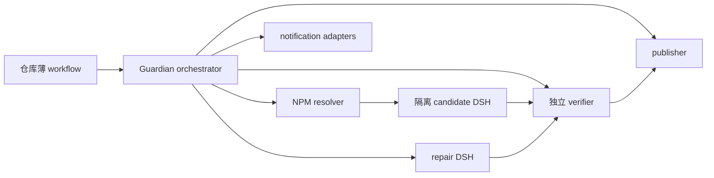
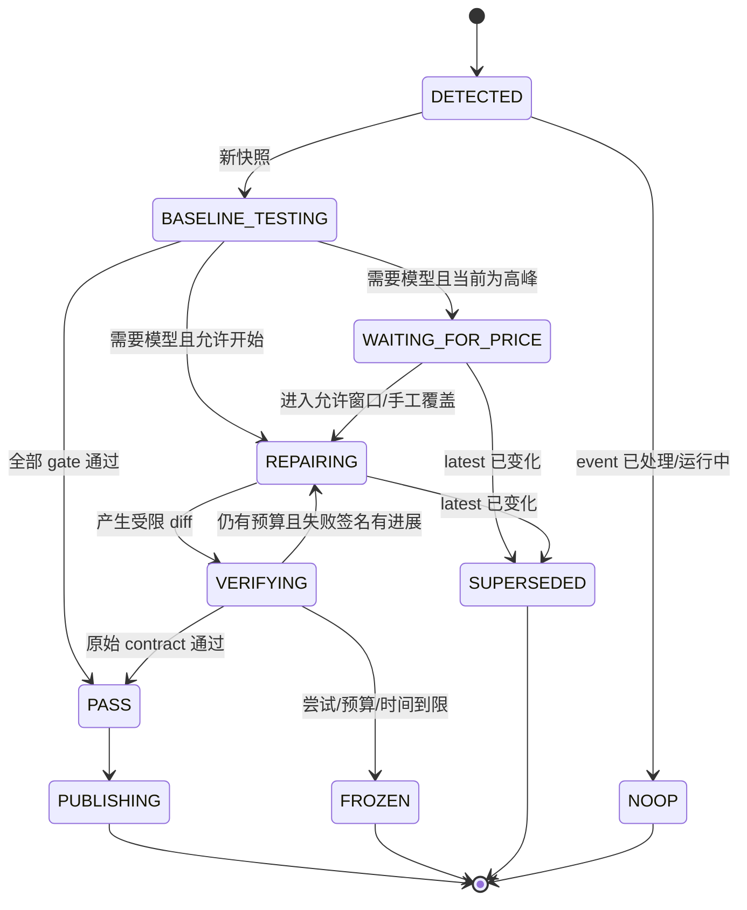

# DSH Plugin Compatibility Guardian：产品与技术设计

状态：Draft 0.3

日期：2026-08-21

## 1. 一句话定义

Guardian 是安装进 DSH 插件仓库的 GitHub Actions 维修机器人：持续追踪 `@deepseek-ai/dsh` 的 NPM `latest`，在隔离环境里验证真实插件；不兼容时调用 DSH 自己在有界预算内修复，再由独立 verifier 复测，最后生成报告和可合并 PR，也可由仓库显式开启自动合并或直接推送默认分支。

它解决的不是“发新版提醒”，而是下面这个完整闭环：

```text
发现最新制品 -> 冻结候选快照 -> 差分兼容测试 -> PASS -> 报告/交付
                                      |
                                      v
                                  失败证据
                                      |
                           等待低价窗口（默认）
                                      |
                                      v
                  稳定 DSH 维修 -> 独立复测 -> PASS/BLOCKED
```

## 2. 先把几个词说清楚

- **当前仓库（current repository）**：安装 Guardian 的插件仓库，是 V1 唯一维护对象和事实来源。
- **upstream**：fork 最初来源的原作者仓库。它可能继续按自己的节奏演进，也可能完全不接受你的补丁。
- **fork**：从别人的仓库复制后由自己维护的版本。即使改了很多补丁，它仍可以独立成为当前仓库。
- **基线（baseline）**：上一次已知能工作的组合，不只是一个 DSH 版本，而是插件 commit、DSH 制品、Node/包管理器/系统、配置与 smoke contract 的组合。
- **候选 DSH（candidate）**：本轮 `latest` 解析出的新版，用来证明插件是否兼容；它是不可信的被测程序。
- **维修 DSH（repair runner）**：已知稳定、允许使用模型并修改隔离 worktree 的 DSH；默认版本可配置，但一轮开始后不得漂移。
- **campaign**：当前仓库对一个目标根 DSH 版本的整次维护活动。Actions rerun、修复轮次和定时唤醒都共享同一预算与状态。

别人所说的“变量很多、基线变化影响大、上游要跟 DSH 走、自己的补丁 fork 不想让原作者处理”，实际是在提醒：如果同时改变 DSH、插件代码、运行环境和原作者分支，就无法知道失败由谁引起，也无法决定把修复送到哪里。

V1 的处理很简单：只改变候选 DSH，其他基线冻结；不区分原创仓库和 fork，只维护安装 Guardian 的当前仓库；不读取、同步、通知或写入 upstream。中央多仓库托管以后再做。

## 3. 已锁定的产品决定

| ID | 决定 |
| --- | --- |
| D1 | V1 是仓库内 GitHub Actions 维修机器人，不建设中央服务、数据库或 GitHub App。 |
| D2 | 只追踪 NPM `latest` 并最终收敛到最新；不为每个中间发布排队。 |
| D3 | candidate 与 repair runner 是两个隔离角色；candidate 无模型长期密钥和 Git 写权限。 |
| D4 | repair DSH 默认 `0.1.1-rc.1`，允许配置为其他固定版、`latest` 或 `target`；每轮开始时解析成精确制品并冻结。 |
| D5 | repair provider/model 默认 `deepseek-official/deepseek-v4-flash-vision-exp`；provider id、base URL、key 环境引用和 model id 均可覆盖，失败不得静默换 route。 |
| D6 | 视觉由所选模型的图片输入能力提供；DeepSeek 联网搜索是 DSH 的独立 search provider 调用，不把两者混称为一个能力。 |
| D7 | onboarding 由 DSH 自动发现 smoke surface，用户可给自然语言 hints；用户只需审核首次 onboarding PR，contract 变化另开 PR。 |
| D8 | 兼容结论必须是差分测试和机器断言；repair agent 的文字声明不算 PASS，也不能在同一维修中改弱 contract。 |
| D9 | 预算按 `repository + target root DSH version` 的整个 campaign 累计；token、估算人民币、墙钟和轮次分别设机械上限。 |
| D10 | 剩余预算到 30% 时可选只发送一次收敛消息；到 0 时拒绝下一次模型请求。 |
| D11 | 每个目标版本只自动维修一次；失败或耗尽后冻结，只有明确新信号才能恢复。 |
| D12 | 用户可增加额度，或把 lock 中 `resetBudget` 从 `N` 改成 `Y/y` 并提交；同一 reset commit 只消费一次。 |
| D13 | 交付默认为 PR；支持显式开启 auto-merge 或 direct-push。只有 publisher 持 Git 写凭据，不绕过 branch protection。 |
| D14 | GitHub Summary/Issue 是默认报告面；email、Telegram 和 webhook 是 orchestrator 内的可选小适配器。 |
| D15 | DSH 版本、模型、价格、峰谷窗口、预算和交付模式都是有默认值的配置，不是写死在引擎里的常量。 |
| D16 | `gh-aw` 只作知识参考，V1 没有它的运行时依赖；provider 协议直接复用 DSH 原生实现。 |
| D17 | V1 只累计 DSH/DeepSeek 暴露的 token usage，并用默认官方价格表估算；不单独实现 OpenAI-compatible 账单解析器。 |
| D18 | 根 DSH 版本号没变但实际安装内容变了，就重新执行完整兼容测试；此时 Actions 会运行，但暂不调用 repair model、不消耗模型 token，也不增加用户配置或预算。 |
| D19 | M0 先在没有模型 key 的情况下验证监控与完整兼容测试；通过后才在隔离测试分支恢复历史 `httpServer` 错误，验证模型维修和 PR。两个阶段均不开自动合并或直接推送。 |
| D20 | 当前处于 grilling 阶段；用户明确宣布 grilling 结束并要求开工前，只允许调研和文档，不实施 workflow、故障场景、secrets 或模型调用。 |
| D21 | repair DSH 默认可修改当前仓库内所有已跟踪的插件文件，不要求每个仓库维护长 allowlist；workflow、Guardian 配置/lock、onboarding smoke contract、独立 verifier、secret 和仓库外路径进入短禁止清单。 |
| D22 | repair DSH 可以提案修改仓库测试，但只要 diff 触及测试文件、测试配置或测试命令，本次交付就强制为普通 PR；即使仓库开启 auto-merge/direct-push，也必须人工审核后才能落库。 |
| D23 | 依赖改动必须与当前 DSH 兼容故障直接相关且保持最小；禁止全量升级、无关升级和更换包管理器。新增/删除依赖、跨 major 升级或改安装生命周期脚本时强制人工 PR；普通 DSH 相关版本范围与 lockfile 调整可在完整复验后使用所选交付模式。 |
| D24 | 仓库有明确构建命令时以源码为权威，repair 后由 verifier 干净重建，已跟踪的 `lib/dist` 必须与重建结果一致；无法复现则失败。仓库没有构建命令且 `lib` 本身被维护时，把它当普通源码。 |
| D25 | repair DSH 可新增、修改和删除普通仓库文件；不为文件创建、重命名或删除另设复杂分级。不能删除的内容直接复用 D21 的保护清单，其他误删由原始 pack/install/contract/verifier 自然判失败。 |
| D26 | 不新增 changed-files/changed-lines 硬上限；报告 diff 文件数和增删行数供人判断，但不据此阻断。防失控继续由 token/CNY/墙钟/轮次预算、单次自动维修、保护路径和独立 verifier 承担。 |

## 4. 最小架构



只有两个代码交付面：

1. 插件仓库里的薄 workflow、配置、smoke contract 和 lock。
2. Guardian 的 versioned reusable workflow/orchestrator。

不增加中央数据库、常驻 gateway、upstream 同步器或独立通知服务。状态由 Git 历史、`.dsh-compat.lock.json`、Actions run、PR/Issue 和短期 artifacts 共同承载。

## 5. 目标解析与 latest 收敛

监控对象不是一个长期运行的 `dsh web` 进程，而是 `npx @deepseek-ai/dsh web` 会解析到的 NPM 制品。

每次唤醒读取 registry packument，得到：

```text
registry + package + dist-tag + root version + root integrity
```

### 为什么版本号没变也可能需要复测

DSH 是由很多内部 NPM 包组成的。根包可能一直显示 `0.1.1-rc.1`，但其中一个内部包允许自动安装更新的小版本，所以两天后的全新 `npx` 实际拿到的内容可能已经不同。

例如：

```text
周一：@deepseek-ai/dsh 0.1.1-rc.1 + 内部 LLM 包 rc.1
周三：@deepseek-ai/dsh 0.1.1-rc.1 + 内部 LLM 包 rc.2
```

对用户来说 DSH 版本号没变，但插件面对的代码变了。这里既不是“永远固定旧依赖”，也不是“测试过程中随时升级依赖”：

- **同一次测试或维修中**：用 package lock 锁定所有依赖，保证失败复现、修复和复测面对同一套代码。
- **以后定时巡检时**：在新的临时目录重新解析一次，检查用户今天全新运行 `npx` 实际会安装什么。

Guardian 不要求用户配置这件事，自动执行下面五步：

1. 在临时目录做一次全新依赖解析，生成“本次实际安装内容”的内部快照；还不启动 DSH，也不调用模型。
2. 快照没变，直接结束，不重复跑兼容测试。
3. 快照变了，完整执行仓库测试、插件打包与安装、`dump-config`、真实 `dsh web` 启动、插件专属 smoke 断言以及清理检查。
4. 上一步会消耗 GitHub Actions 运行时间，但不调用 repair DSH 的模型，所以不产生模型 token。测试通过就更新 lock/报告里的兼容证据。
5. 测试失败才考虑模型维修：该根版本还没用过自动维修就按正常流程维修；已经维修过或冻结过就只发通知，等用户把 `resetBudget` 从 `N` 改成 `Y`。

内部只把快照保存成一个短指纹 `installGraphDigest`，作用相当于“这次实际安装内容的编号”。用户不填写、不操作它。编号变化不会得到第二份模型预算；预算始终仍是“仓库 + 根 DSH 版本”。

当运行中的目标不再是当前 `latest`：

- 立即停止新的模型请求；
- 标记旧任务 `SUPERSEDED`；
- 不发布旧版本兼容 PR；
- 新任务从当前 `latest` 建立快照。

因此连续出现 `A -> B -> C` 时，Guardian 的承诺是最终证明或修复 C，而不是浪费预算依次维护 A、B、C。

## 6. 状态机与防死循环



机械防循环门：

1. 仓库级 concurrency 保证同一仓库只有一个活跃 campaign controller。
2. event key 去重；schedule rerun 只回读状态，不重新调用模型。
3. 每个目标版本只有一个自动维修 campaign，内部最多执行配置的有限轮次。
4. 同一个 verifier 失败签名连续出现两次就停止下一轮同类补丁。
5. bot commit、workflow 自身 push 和已存在的确定分支不会递归创建新 campaign。
6. repair agent 无权提高预算、改 workflow、改 smoke contract、改 lock 或判定 PASS。
7. 新 `latest` 会使旧任务 `SUPERSEDED`，旧任务不能迟到发布。
8. 冻结目标只有用户 push、额度增加、有效 reset 边沿或新的制品/源码证据才能恢复。

## 7. Onboarding：只审核一次什么

首次安装会生成 onboarding PR，内容限定为：

- `.github/workflows/dsh-compat.yml`：薄调用入口和明确的最小权限；
- `.dsh-compat.yml`：仓库配置；
- `compatibility/dsh-smoke.yml` 及必要脚本：机器可执行兼容 contract；
- `.dsh-compat.lock.json`：空的 verified 状态和控制位；
- 一份“发现了哪些 surface、为什么这样断言”的审阅报告。

DSH 默认从 `package.json`/manifest、源码入口、README、已有 test/build/pack 命令和 Web/CLI/API 暴露面自行发现。用户可在 `smoke.hints` 中补一句专属要求，例如：

```text
安装后必须打开 /plugins/acme/client.js，并在真实页面点击命令面板，断言插件命令可执行。
```

用户审核的不是一段泛化提示词，而是随后每次维修都会执行的确定性断言。维修中若发现 contract 本身需变更，只能另开 `CONTRACT_CHANGE_REQUIRED` PR；不能把“改测试让它过”混进兼容修复。

插件新增入口或主要能力时才需要再次审核 contract PR，不要求每个 DSH 新版本都人工重审同一合同。

## 8. 差分兼容验证

每次完整验证使用同一个插件树和同一套 contract，只改变 DSH：

1. 上一次 `verified` 的已知兼容 DSH + 当前插件树，证明仓库基线没有先坏。
2. 目标 candidate + 同一插件树，复现新版差异。
3. repair 后的插件树 + 同一精确 candidate 快照，运行全部原始 gate。

最低 gate：

| Gate | 要证明的事实 |
| --- | --- |
| G0 制品权威 | dist-tag、根版本/integrity、安装图 digest 与实际 `dsh --version` 一致。 |
| G1 仓库基线 | 原有 test/typecheck/build 与 `npm pack --dry-run` 通过。 |
| G2 安装生命周期 | fresh `DSH_HOME` 中真实 pack/add、dump-config、remove、再次 dump。 |
| G3 真实启动 | 动态端口启动真实 `dsh web`/headless，HTTP 与进程生命周期正常。 |
| G4 插件行为 | 至少一个插件专属 CLI/API/浏览器断言，不只检查首页 200。 |
| G5 视觉（适用时） | 给当前解析模型传入真实图片或截图，消费结果；不能用文字替代图片。 |
| G6 清理与幂等 | 端口释放、进程回收、重复安装/卸载不污染下一轮。 |
| G7 交付安全 | diff allowlist、secret scan、contract digest 和报告 schema 均通过。 |

PASS 只对报告中的精确 tuple 成立：

```text
plugin commit/tree
+ candidate root version/integrity/install graph digest
+ Node/package manager/OS/profile
+ smoke contract digest
+ effective repair config and price revision
```

## 9. 隔离与权限

每次 event/attempt 使用新的临时根：

```text
$RUNNER_TEMP/dsh-compat/<event-key>/<attempt>/
  repair-home/
  candidate-home/
  repair-worktree/
  verify-copy/
  artifacts/
```

- candidate 不获得 `DEEPSEEK_API_KEY`、Git 写 token、`.git` 或 Docker socket。
- repair DSH 只获得 DSH 原生 provider/settings/credentials 所需的模型凭据和受限 worktree。
- publisher 在 verifier PASS 后单独获得最小 GitHub 写权限；repair 进程永远接触不到它。
- checkout 使用 `persist-credentials: false`；报告和 artifacts 在写入前脱敏。
- 必须经过 candidate 真实模型 turn 才能验收的插件，默认需要单次低额度凭据；不能签发时标记 BLOCKED，不把长期 key 交给 candidate。

## 10. Repair DSH、模型、视觉与搜索

默认配置为：

```text
repair DSH: 0.1.1-rc.1
provider:   deepseek-official
model:      deepseek-v4-flash-vision-exp
```

这些只是仓库可覆盖的默认值，不是引擎常量。用户可以配置 DSH 已支持的 provider id、base URL、API key 环境变量引用和 wire model id。无论用户填固定版本、`latest` 还是 `target`，campaign 开始后都解析并记录实际 DSH version/integrity/install graph、provider、base URL identity 和 model；后续轮次不允许漂移，失败也不静默回退到另一个 route。Guardian 不再实现一层 provider 协议。

当前官方 DSH 发布制品已把默认模型声明为 `inputModalities: [text, image]`，所以 repair agent 可以直接查看失败截图、页面渲染、图表或插件 UI，而不需要另造视觉 sidecar。

联网搜索必须单列：`@deepseek-ai/dsh-web-search-deepseek` 会通过 Anthropic 兼容端点发起一笔独立模型请求并调用服务器端 `web_search` 工具。它复用 API key，但不自动复用 chat-completions 的 base URL。默认让搜索 provider 也选择视觉模型；仓库可覆盖，真实搜索 probe 未通过时应明确失败，不能偷偷换普通 Flash。

## 11. 维修合同

每轮只给 repair DSH：

- 原始兼容目标、contract digest 和禁止降级项；
- 插件 baseline、candidate 精确快照与当前 latest 证据；
- 失败命令、退出码、脱敏关键日志、截图和 artifact 路径；
- 上一轮 diff、verifier 结果和失败签名；
- 可修改/禁止路径、剩余预算和 deadline。

默认可修改当前仓库内所有已跟踪的插件文件，包括源码、`src/lib`、`cordis.patch.yml`、`package.json`、安装脚本、仓库测试和文档。插件结构差异很大，因此不要求用户为每个仓库维护一份长 allowlist。

短禁止清单保护控制面和独立验收面：`.github/workflows/**`、`.dsh-compat.yml`、`.dsh-compat.lock.json`、onboarding smoke contract、独立 verifier、secret/凭据文件，以及解析后落到仓库外的路径。禁止项不能由 repair prompt、仓库文件或模型输出放宽；publisher 只接受禁止路径之外的 diff。最终 PASS 仍由 repair DSH 无法修改的 contract/verifier 判定。

仓库自己的测试允许随兼容修复一起提案修改，但不能让机器人同时修改测试又自动把结果落进默认分支。publisher 在 diff 中发现测试文件、测试配置，或 `package.json` 等 manifest 里的测试命令发生变化时，必须把本次交付强制降级为普通 PR，并在报告里列出触发路径；仓库配置的 `auto-merge`/`direct-push` 只对没有改动测试面的维修生效。新增测试也按测试改动处理。

依赖变更采用最小因果规则：失败证据必须能说明该改动是适配当前 candidate DSH 所需，允许调整已有 DSH 相关依赖的版本/范围并同步当前包管理器的 lockfile。publisher 机械拒绝全量升级、无关依赖升级和包管理器切换；发现新增或删除依赖、跨 major 升级，或 `preinstall`/`install`/`postinstall` 等安装生命周期脚本变化时，本次交付强制为普通 PR。普通 DSH 相关版本范围及其 lockfile 变化在完整 verifier 通过后仍可使用仓库所选交付模式。

`lib/dist` 等目录不靠名字猜是不是生成物。若仓库声明了可执行的构建命令并同时保留对应源码，源码是权威；repair diff 应先改源码，verifier 再从干净 worktree 安装冻结依赖并构建，要求所有已跟踪构建产物与维修分支中的结果逐字节一致。重建失败、出现未声明差异或构建不稳定时不得 PASS。若仓库没有构建命令、`lib` 就是实际维护入口，则将它视为普通源码，允许直接修改；当前 attachments fixture 属于这一类。可重复构建且完全一致的产物变化本身不触发人工 PR 降级。

文件增删保持简单：repair DSH 可以在仓库内新增、修改或删除普通文件，不单独区分重命名、可执行文件、隐藏文件或根目录文件。`.github/workflows/**`、Guardian 配置/lock、onboarding smoke contract、独立 verifier、secret/凭据和仓库外路径本来就不可修改，因此也不可删除。普通关键文件若被误删，原始 build/test/pack/install/contract/verifier 必须自然失败，不再维护第二份“关键文件清单”。已经确认的测试面和依赖语义规则仍适用于新增或删除内容。

不把 diff 大小变成另一套预算。报告固定记录改动文件数、新增行数和删除行数，但不设置 `maxChangedFiles` 或 `maxChangedLines`，因为生成产物和必要重构会让这些数字失真。运行失控由已有的模型 token/CNY、墙钟、维修轮次、每版本一次自动维修、保护路径和独立 verifier 机械限制。

默认最多两轮。每轮结束后 agent 只能交付 diff；独立 verifier 从干净副本应用 diff 并重新执行原始合同。

## 12. Campaign 预算

预算范围固定为 `repository + target root DSH version`，并跨 Actions rerun、schedule、repair attempt 和通知重试累积：

```text
hard stop = token / CNY / wall time / attempt 任一启用上限耗尽
steer     = 任一主要预算剩余比例 <= 30%，且本 campaign 尚未发送过
```

MVP 累计 DSH/DeepSeek 已经暴露的 token usage，包括主 repair session、子 agent、压缩和重试。独立 DeepSeek 搜索目前不暴露 usage，因此只记录调用次数、所选模型和结果状态，不为这点小额误差另造计费通道。

人民币按带 revision 的 provider/model/tariff 快照估算：

```text
cost = cache_hit_input * hit_rate
     + uncached_input * miss_rate
     + output * output_rate
```

图片由官方按尺寸换算为输入 token，随 provider usage 进入同一预算。搜索等未暴露 usage 的辅助调用不会伪造 token 数：报告单列 `unmeteredSearchCalls`，token/CNY 总数注明只覆盖已报告 usage。因此本地 hard stop 是基于可见 usage 的工程上限，不是供应商账单保证；需要绝对金额上限时仍由 provider 侧限额负责。

默认只实现 DeepSeek 官方 usage 口径。OpenAI-compatible route 可以通过 DSH 原生 provider 使用，但 V1 不另写 OpenAI usage/账单解析器；若 DSH 已把它归一化为标准 usage，就自然进入 token 统计，否则只报告缺失。自定义 provider/model/base URL 没有匹配价格映射时仍执行 token 上限，CNY 显示 `unknown`，用户可覆盖 price map。

剩余 30% 时只发送一次：

```text
[budget-controller]
剩余预算已低于 30%。停止扩展范围；优先完成最小修复、运行决定性检查、记录未解决项并尽快结束。
```

到 0 后不发起下一次请求；已经在途的请求仍可能造成少量越界。公共仓库的标准 GitHub-hosted Actions 当前不计入模型 CNY 预算，但仍限制墙钟、并发、轮次和 artifact 保留，避免资源死循环。

## 13. 峰谷价格调度

默认 DeepSeek 官方价格快照（2026-08-21，单位 CNY/百万 token）：

| 时段 | 缓存命中输入 | 缓存未命中输入 | 输出 |
| --- | ---: | ---: | ---: |
| 低价 | 0.05 | 1.50 | 4.50 |
| 高峰 | 0.10 | 3.00 | 9.00 |

默认时区 `Asia/Shanghai`；每日高峰为 `09:00–12:00`、`14:00–18:00`，其余时间为低价。所有值均可由仓库覆盖，并把 source、revision、timezone 和生效费率写入证据；自定义 route 只有显式声明沿用官方计价或提供自己的 price map，才计算 CNY，否则只统计 token。

调度规则：

1. registry 探测和不调用模型的确定性 gate 立即执行。
2. 只有确认需要维修时，才判断当前是否在配置的低价窗口。
3. 高峰时进入 `WAITING_FOR_PRICE`，不消耗模型预算。
4. workflow 用周期 poll 唤醒并自行检查窗口；不能依赖 GitHub cron 在低价开始时准点运行。
5. 等待期间若 `latest` 变化，旧目标 `SUPERSEDED`，直接合并到新目标。
6. `workflow_dispatch` 可显式选择立即执行；报告必须标记这次价格窗口 override。

## 14. 最小 lock 与一次性 reset

建议形状：

```json
{
  "schema": 1,
  "verified": {
    "pluginCommit": null,
    "targetVersion": null,
    "targetIntegrity": null,
    "installGraphDigest": null,
    "contractDigest": null,
    "report": null
  },
  "campaign": {
    "targetVersion": null,
    "status": "IDLE",
    "automaticRepairUsed": false,
    "budgetEpoch": 0,
    "consumed": { "tokens": 0, "estimatedCny": 0 }
  },
  "control": {
    "resetBudget": "N",
    "consumedResetCommit": null
  }
}
```

规则：

- `verified` 只有 verifier PASS 后由 publisher 推进；失败绝不能写成“支持”。
- 到限时状态变为 `FROZEN`，publisher 保持 `resetBudget: N` 并在 Issue 中给出操作说明。
- 用户把 `N` 改成 `Y/y` 后 commit + push，commit SHA 就是一次 reset nonce。
- 同一 SHA 在 workflow rerun 或 schedule 中只消费一次；静态 `Y` 不会反复充值。
- reset 开启新 budget epoch，旧 epoch 的实际消耗保留在报告和累计总额里，不伪装成没花过。
- 再次 reset 需要新的 `N -> Y` 边沿；用户也可以只提高配置上限，此时保留原 consumed 并获得新增余量。
- repair agent 不能编辑 lock；用户控制 `control`，publisher 控制运行态和 `verified`。
- `automaticRepairUsed` 只回答“这个根版本是否已经花过一次自动维修机会”；内部组件变化不会把它偷偷改回 `false`。

## 15. 交付与通知

三种交付模式：

| 模式 | 默认 | 行为 |
| --- | --- | --- |
| `pull-request` | 是 | 推确定分支并创建/更新可合并 PR。 |
| `auto-merge` | 否 | PR 的 required checks 通过后请求 GitHub 自动合并。 |
| `direct-push` | 否 | verifier PASS 后直接更新默认分支；branch protection 拒绝则 BLOCKED。 |

无代码改动仍更新 lock 和窄报告，提交“已验证支持目标版本”。有修复时，代码、必要测试、lock 和报告进入同一次交付。

失败只创建或更新一个按 campaign key 去重的 Issue/草稿报告，包含最小复现、失败 gate、尝试、预算、当前 diff 和人工接手点，不制造“已兼容”提交。

通知顺序为：GitHub Summary/Issue；然后按配置分发 email、Telegram 或通用 webhook。适配器只接收去敏结构化事件 `PASS | BLOCKED | SUPERSEDED`，不接收 key、原始 transcript 或完整环境变量。

## 16. GitHub Actions 边界

- reusable workflow 的 secrets 必须显式传入；默认 job 使用 read-only `GITHUB_TOKEN`。
- candidate/verifier job 与 publisher job 分权；不让不可信 artifact 直接变成有权限脚本。
- 使用 concurrency、job timeout 和确定分支；GitHub 自带的 `GITHUB_TOKEN` 防递归规则只是第二道防线。
- scheduled workflow 只在默认分支定义生效，可能延迟；公开仓库长期无活动还可能被自动禁用，所以 cron 只是唤醒器。
- 公共仓库标准 runner 当前免费，不代表可无限运行；墙钟和循环上限仍是产品约束。

## 17. 非目标

V1 不做：

- 中央批量托管或多租户控制台；
- 自动同步/联系 upstream；
- 自研 provider 协议适配层；
- `gh-aw` 运行时；
- 默认遍历所有历史 DSH 版本；
- 独立通知 gateway 服务；
- 自动修改兼容 contract 以换取 PASS；
- 绕过 branch protection、secret policy 或 verifier。

## 18. 实现顺序

### M0：Onboarding 与真实 gate

首个样本已确定为公开独立仓库 [`LCYLYM/dsh-attachments-guardian-fixture`](https://github.com/LCYLYM/dsh-attachments-guardian-fixture)。它从正式仓库 `LCYLYM/dsh-attachments@028dc1f` 全新复制，保留真实 Web client、Host patch、安装器与 10 项测试，但设为 `private: true` 防止误发 NPM，并明确标为自动维修测试副本。

M0 在该仓库生成 onboarding PR，用固定 candidate 打通 fresh `DSH_HOME`、pack/add/dump/start/插件专属断言/remove/report，先不调用维修模型。

M0 分成两个清楚的验收阶段：

1. **先证明“会检查”**：不配置模型 API key，只运行版本探测、仓库测试、插件打包安装、`dump-config`、真实 `dsh web` 启动、插件专属 smoke、清理、报告、lock 更新和重复触发去重。任何失败只报告，不修代码。
2. **再证明“会维修”**：第一阶段稳定后，在隔离测试分支把已经发生过的 `WebServer` 契约改回错误的 `httpServer`，形成可解释、可复现的真实兼容故障；这时才配置 repair model。机器人必须复现失败、恢复正确接口、重新跑完第一阶段全部检查，并创建修复 PR。

两个阶段都使用 `pull-request` 模式，关闭 `auto-merge` 和 `direct-push`。第二阶段的故障分支、secret 与模型调用目前都只在设计中，grilling 结束前不得创建或执行。

### M1：latest 收敛与状态

加入 registry resolver、真实安装图快照、event/budget key、lock、concurrency、`SUPERSEDED` 和低价等待状态。

### M2：受控维修

接入默认 repair DSH/模型、图片证据、失败包、diff allowlist、独立 verifier、两轮上限和冻结/reset。

### M3：预算、搜索与交付

接入 DeepSeek usage 去重、人民币价格快照、搜索调用计数、30% steer、基于可见 usage 的 hard stop、PR/auto-merge/direct-push 和通知适配器。

## 19. 待继续 grill

下一项是确定 repair model secret 只允许在哪些可信触发来源中使用，避免不受信任的 PR 代码读取仓库凭据。其余已经确认的决定不因后续讨论自动重开。
