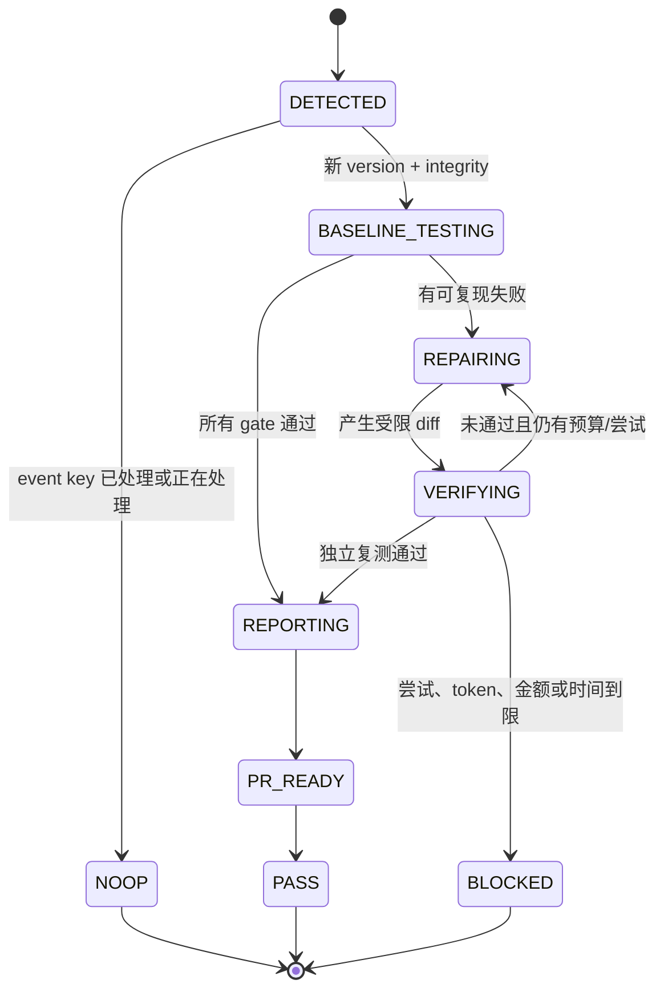

# DSH Plugin Compatibility Guardian：方案与讨论稿

状态：Draft 0.1

日期：2026-08-21

## 1. 一句话定义

当 `npx @deepseek-ai/dsh web` 背后的 NPM dist-tag 指向新版本时，自动化用全新的 `DSH_HOME` 和隔离工作目录验证插件；失败后由固定的已知稳定版 DSH 在限额内尝试修复；只有独立兼容 verifier 全部通过，才生成报告并推送兼容分支或 Pull Request。

核心闭环是：

```text
发现版本 -> 锁定候选制品 -> 无密钥隔离测试 -> 通过 -> 报告/PR
                                      |
                                      v
                                  失败证据
                                      |
                                      v
                  固定稳定版 DSH 修复 -> 无密钥隔离复测
                                      |
                       PASS ----------+---------- BLOCKED
```

## 2. 第一版产品形态

V1 做成“可复用 GitHub Action + orchestrator CLI”，由每个插件仓库自己运行：

- 插件仓库拥有源码、兼容声明、GitHub secrets 和最终 PR。
- Guardian 仓库拥有版本解析、状态机、隔离运行、预算账本、报告格式和修复提示合同。
- 插件仓库只新增一个 workflow、`.dsh-compat.yml` 和必要的真实兼容测试。
- 后续若要集中管理大量仓库，再在同一 orchestrator 上增加 GitHub App 控制面；V1 不先承担多租户、安装授权和中央数据库。

这样能先验证真正的难点：DSH 新版是否可被准确发现、插件是否能在隔离新版中真实启动、稳定 DSH 能否在预算内修到 verifier 通过。

## 3. 两个 DSH 版本必须分开

流水线始终区分两个角色：

| 角色 | 版本策略 | 权限 | 用途 |
| --- | --- | --- | --- |
| Repair runner | 手工确认并固定的已知稳定版本 | 可改隔离 worktree；可使用模型 endpoint；不能 push | 阅读失败证据、修改插件 |
| Candidate runtime | NPM channel 当前解析出的精确版本与 integrity | 无模型 secret、无 Git 写凭据；在沙箱中执行 | 验证插件是否兼容新版 |

稳定 runner 不跟随被监测的 `latest` 自动升级。升级 runner 是另一条人工确认流程；否则一旦新版 DSH 自身有回归，修复器和被测对象会同时失去可信基线。

## 4. “监控 npx”应监控什么

`npx @deepseek-ai/dsh web` 默认解析 NPM 的 `latest` dist-tag。监控器不需要周期性启动 Web 来判断版本，而是读取 registry packument，并记录：

```text
registry + package + channel + resolved version + dist.integrity
```

默认 channel 为 `latest`。可选 `next` canary，但两个 channel 独立记账、独立出报告，不能把 `next` 通过写成“支持 latest”。也不使用“所有已发布版本中 semver 最大者”替代 dist-tag，因为未被 tag 指向的版本不等于 `npx` 默认会运行的版本。

事件键建议为：

```text
sha256(repository, package, channel, version, integrity, contract_schema_version)
```

相同事件键处于 `RUNNING`、`PASS` 或已达重试上限时，定时触发只回读状态并退出。

## 5. 状态机



每个状态转移写入单写者账本。并发 worker 只产出 append-only 事件或独立 artifact，不共同改一个 JSON 文件。

## 6. 隔离模型

每次候选版本、每次修复尝试使用新的运行根：

```text
$RUNNER_TEMP/dsh-compat/<event-key>/<attempt>/
  runner-home/       # 稳定版 DSH 的会话与配置
  candidate-home/    # 候选版的独立 DSH_HOME
  repair-worktree/   # 允许稳定 runner 修改的 Git worktree
  verify-copy/       # 不含 .git 和 secrets 的验证副本
  artifacts/         # 结构化测试证据
```

候选版在受限容器中执行：不注入 `DEEPSEEK_API_KEY`、`DEEPSEEK_BASE_URL`、`GITHUB_TOKEN`，不挂载 Docker socket，不挂载 `.git`，能力与资源设上限。插件与 candidate 都按不可信可执行代码处理。

稳定 runner 的模型 key 只进入修复步骤。Git checkout 使用 `persist-credentials: false`；push 凭据只在最终 broker 步骤临时出现。稳定 runner 可以编辑 worktree，但不能直接发布、push、改 workflow 或降低 verifier。

默认兼容 gate 设计成不需要模型调用。若某个插件只有经过真实模型 turn 才能验收，则必须二选一：

- 使用 endpoint 侧签发的单次、低额度、可撤销 token，只暴露给 candidate 容器；
- 明确开启高风险模式，把仓库 secret 暴露给 candidate，并接受新发布制品可读取该 secret 的供应链风险。

建议只实现第一种。若当前 `base_url` 不支持子 token 或服务端配额，这类“候选版真实模型验收”应标为 BLOCKED，不把稳定 runner 的长期 key 静默传进去。

## 7. 兼容性 gate

通用 gate 与插件自有 gate 共同决定 PASS：

| Gate | 要证明的事实 | 最低证据 |
| --- | --- | --- |
| G0 版本权威 | 被测制品就是 channel 当前版本 | version、integrity、`dsh --version` 三者一致 |
| G1 仓库基线 | 插件自身没有先验失败 | 仓库声明的 test/typecheck/build、`npm pack --dry-run` |
| G2 安装生命周期 | 新 DSH profile 能安装和移除插件 | fresh `DSH_HOME` 中 add、dump-config、remove、再次 dump |
| G3 真实启动 | 插件组合后 Web 能启动 | 动态端口、进程存活、首页 HTTP、插件资源路由 |
| G4 插件行为 | 用户真正使用的插件能力可用 | 插件仓库提供的 Playwright/API/CLI 测试 |
| G5 清理与幂等 | 不残留进程或污染下一次运行 | 端口释放、二次安装/卸载、临时根可丢弃 |
| G6 交付安全 | agent 没有绕过验收或泄密 | diff allowlist、secret scan、报告 schema 校验 |

G2 的 `--dump-config` 只能证明组合结果，不能替代 G3/G4。历史上已经出现过“安装、组合、卸载都成功，但真实 `dsh web` 等待已改名 service”的失败。

Web 插件 V1 默认要求一个仓库自有入口，例如：

```text
npm run test:compat:dsh
```

该入口由 Guardian 注入 `DSH_VERSION`、`DSH_HOME`、`DSH_WEB_URL` 和已打包插件路径。测试必须消费真实 candidate，不得 mock DSH host API。

## 8. 自动修复合同

稳定 DSH 每轮只收到：

- 原始兼容目标和禁止降级项；
- 插件基线 commit、candidate version/integrity；
- 当前失败命令、退出码、经脱敏的关键日志和 artifact 路径；
- 上一轮 diff 与 verifier 结果；
- 可修改路径、禁止路径和剩余预算。

默认允许修改插件源码、插件测试、插件文档和必要 lockfile。默认禁止修改：

- `.github/workflows/**`；
- Guardian/verifier 本身；
- `.dsh-compat.yml` 中的 gate、预算和权限；
- 已生成的 PASS 报告；
- secret、全局配置或仓库外路径。

Verifier 是独立进程，以原始 gate 为准。DSH 的文字回复、文件存在或它自己声称“已修复”都不计 PASS。

默认最多 2 次 repair attempt；两次仍是同类失败时停止继续打补丁，输出 `BLOCKED`、最小复现和当前 diff。这个上限可配置，但不能由修复 agent 自己提高。

## 9. Token 与人民币预算

预算同时支持 token、估算人民币和墙钟时间：

```text
hard stop = 任一已启用预算耗尽
converge = 任一已启用预算的剩余比例 <= 30%
```

Token 口径使用 provider/DSH usage 事件，按 `input + cache_read + cache_write + output` 汇总，并按 turn/step 去重，避免流式 usage 与最终 message 重复计数。

人民币金额由仓库中的版本化价格表计算：

```text
cost_cny = input * input_rate
         + cache_read * cache_read_rate
         + cache_write * cache_write_rate
         + output * output_rate
```

价格键必须精确到 `provider/model`，单位统一为“元/百万 token”。配置了人民币上限但找不到精确价格时，任务在调用模型前失败，不用未知价格继续烧额度。估算金额与供应商账单分开标注。

达到 30% 剩余额度时，budget controller 只发送一次带来源标记的 `steer` 消息，使其在下一个 step 边界可见：

```text
[budget-controller]
剩余预算已低于 30%。停止扩展范围；优先完成最小修复、运行决定性检查、记录未解决项并尽快结束。
```

到 0 时拒绝发起下一次模型请求并终止 runner。一次已经在途的模型请求仍可能少量超出本地估算；若要求金额绝不越线，需要让 `base_url` 指向能执行服务端配额的代理，而不能只靠 CI 本地计数。

## 10. 防死循环

防循环不能只依赖提示词，至少有以下机械门：

1. `schedule`/`workflow_dispatch` 作为版本监测入口；自动生成的 commit 不主动递归 dispatch。
2. 仓库级 concurrency group 保证同一插件一次只有一个兼容任务。
3. event key 去重；同一 version/integrity 不重复开新分支或 PR。
4. 分支名确定化：`automation/dsh-compat/<channel>/<version>`；存在则续用，不创建编号分支。
5. 机器人 commit 带 `DSH-Compat-Event` trailer；监测器读账本，不靠 commit message 单独判断。
6. 自动化用 `GITHUB_TOKEN`，同时保留显式 origin guard；不把 GitHub 的“多数 GITHUB_TOKEN 事件不递归触发”当唯一防线。
7. `max_repair_attempts`、`max_wall_minutes`、token/CNY hard limit 互相独立，任一到限即 BLOCKED。
8. 同一个 verifier 失败签名连续出现两次，停止第三次同模型修补。
9. Agent 无权修改 gate、预算、workflow 和 event ledger。
10. PASS 报告必须包含 candidate integrity；只写版本号不算已处理。

## 11. 交付与报告

默认交付模式为 Pull Request：

- 无代码改动也会提交一份窄的兼容报告，说明该 commit 已验证 candidate。
- 有修复时，代码、必要测试和报告进入同一兼容分支。
- PR 标题示例：`chore(dsh): support @deepseek-ai/dsh 0.1.1-rc.1`。
- 主分支直接 push 作为可选模式，只有仓库明确开启且 branch protection 允许时使用。

Tracked 报告只保留去敏摘要：版本、integrity、插件 commit、运行矩阵、各 gate、修复 diff 摘要、token/估算金额、结论和 Actions URL。原始模型 transcript、secret、完整环境变量和大段日志只留在短期 artifact，且仍需脱敏。

BLOCKED 时不开“已兼容”报告；创建或更新一个 Draft PR/Issue，附最小复现、失败 gate、尝试次数和人工接手点。

## 12. 建议配置面

完整示例见仓库根目录的 `.dsh-compat.example.yml`。关键配置分为：

- `watch`：registry、package、channel；
- `runner`：固定稳定 DSH、provider/model、secret 名称；
- `plugin`：打包目录、安装 spec、profile/surface；
- `gates`：仓库命令和真实消费面测试；
- `budget` / `pricing`：尝试、token、人民币、时间和 30% 收敛；
- `delivery`：PR 或 direct push、分支前缀和自动合并策略。

## 13. 实现顺序

### M0：真实小样

选一个已有 Web 插件仓库，手工指定 candidate 版本，打通 detect 之后的完整路径：fresh `DSH_HOME`、pack/add/dump/start/browser/remove/report。先不调用模型。

### M1：监测和去重

加入 NPM dist-tag resolver、integrity 锁定、event ledger、schedule/manual workflow 和 deterministic branch。

### M2：受控修复

接入固定稳定版 DSH、失败证据包、diff allowlist、独立 verifier 和 2 次尝试上限。

### M3：预算与收敛

接入 usage 去重、版本化 CNY 价格表、30% 单次 steering、hard stop 和墙钟限制。

### M4：可复用发布

发布 versioned GitHub Action/CLI，补 Node/OS/profile matrix 和多插件仓库示例；最后才评估 GitHub App。

## 14. 需要确认的产品决策

1. 成功后默认开 PR，还是直接 push 主分支？建议默认 PR，允许单仓库显式打开 direct push。
2. 默认只监控 `latest`，还是同时跑 `next`？建议 `latest` 为阻断/修复 lane，`next` 为可选 canary lane。
3. 第一只真实小样插件选哪个仓库？建议使用已经有真实 Web 启动与浏览器证据的插件，先证明 orchestrator，而不是同时补插件测试基础设施。
4. 默认修复上限是否采用：2 次、60 分钟、token/CNY 由仓库显式配置、30% steering 开启？
5. 固定稳定 runner 选哪个已知可真实调用模型并能修代码的版本？它需要先单独做一次 bootstrap 验收，不能直接把当前 `latest` 当稳定结论。
6. 是否存在必须经过候选 DSH 真实模型 turn 才能验收的插件？若存在，当前 `base_url` 能否签发单次限额 token？
